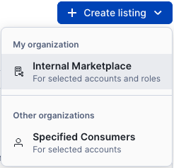
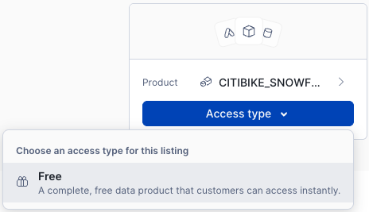
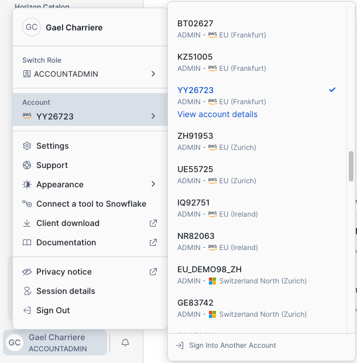
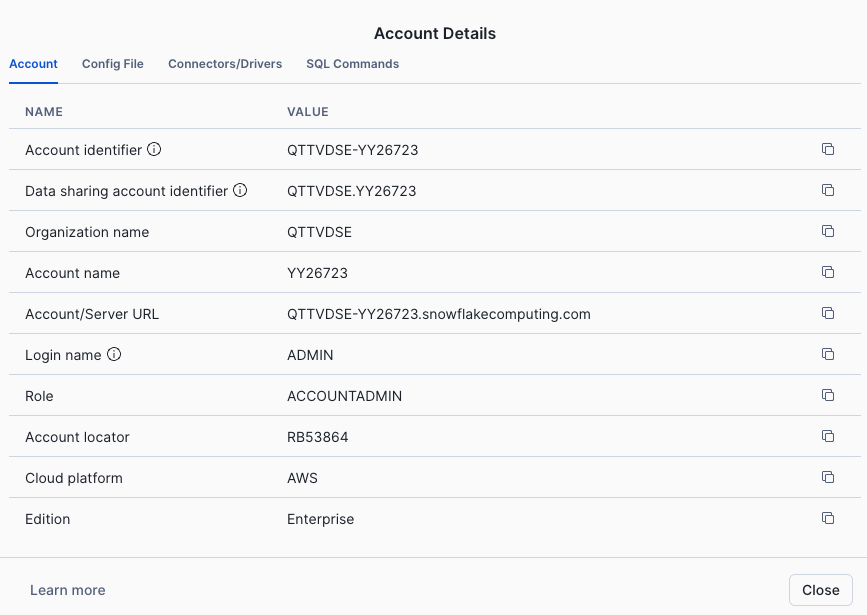
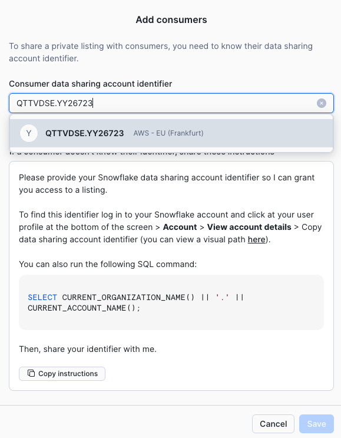
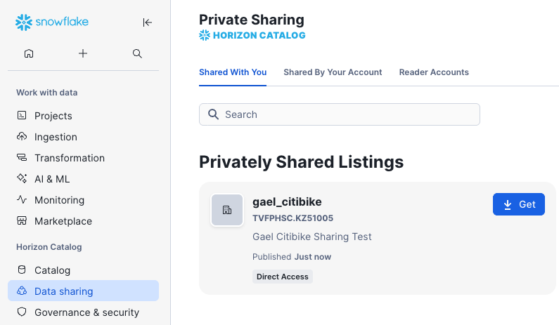

# Session 1: Snowflake Platform Fundamentals - Quick Reference

## Session Agenda

| # | Topic | Duration | Description |
|---|-------|----------|-------------|
| 1 | Virtual Warehouses | 10 min | Understanding compute resources and scaling |
| 2 | Data Ingestion & Storage | 10 min | Loading data with stages and files |
| 3 | Time Travel & Cloning | 10 min | Query historical data and zero-copy cloning |
| 4 | Secure Data Sharing | 10 min | Share data across organizations without copying |
| 5 | Streamlit Apps | 5 min | Build interactive data applications |

---

## Virtual Warehouses

```sql
-- Create warehouse
CREATE OR REPLACE WAREHOUSE demo_wh
    WAREHOUSE_SIZE = 'MEDIUM'
    WAREHOUSE_TYPE = 'STANDARD'
    AUTO_SUSPEND = 60
    AUTO_RESUME = TRUE
    INITIALLY_SUSPENDED = TRUE
    COMMENT = 'Warehouse for platform fundamentals demo';

-- Verify warehouse
SHOW WAREHOUSES;

-- Resize warehouse
ALTER WAREHOUSE demo_wh SET WAREHOUSE_SIZE = 'SMALL';

-- Suspend warehouse
ALTER WAREHOUSE demo_wh SUSPEND;
```

---

## Data Ingestion

### Setup and Load Citibike Data

```sql
-- Create database
CREATE OR REPLACE DATABASE CITIBIKE;
USE DATABASE CITIBIKE;
USE WAREHOUSE demo_wh;

-- Create table
CREATE OR REPLACE TABLE trips (
    tripduration INTEGER,
    starttime TIMESTAMP,
    stoptime TIMESTAMP,
    start_station_id INTEGER,
    start_station_name STRING,
    start_station_latitude FLOAT,
    start_station_longitude FLOAT,
    end_station_id INTEGER,
    end_station_name STRING,
    end_station_latitude FLOAT,
    end_station_longitude FLOAT,
    bikeid INTEGER,
    membership_type STRING,
    usertype STRING,
    birth_year INTEGER,
    gender INTEGER
);

-- Create stage
CREATE OR REPLACE STAGE citibike_trips 
    URL = 's3://snowflake-workshop-lab/demo98/trips/';

-- List files
LIST @citibike_trips;

-- Create file format
CREATE OR REPLACE FILE FORMAT csv 
    TYPE = 'csv'
    COMPRESSION = 'auto' 
    FIELD_DELIMITER = ',' 
    RECORD_DELIMITER = '\n'
    SKIP_HEADER = 0 
    FIELD_OPTIONALLY_ENCLOSED_BY = '\042' 
    TRIM_SPACE = false
    ERROR_ON_COLUMN_COUNT_MISMATCH = false 
    ESCAPE = 'none' 
    ESCAPE_UNENCLOSED_FIELD = '\134'
    DATE_FORMAT = 'auto' 
    TIMESTAMP_FORMAT = 'auto' 
    NULL_IF = ('', 'NULL', 'null');

-- Load data with SMALL warehouse (note the time)
COPY INTO trips 
FROM @citibike_trips 
FILE_FORMAT = csv 
PATTERN = '.*csv.*';

-- Count records
SELECT COUNT(*) FROM trips;

-- Preview data
SELECT * FROM trips LIMIT 10;
```

### Test Warehouse Scaling Performance

```sql
-- Clear table
TRUNCATE TABLE trips;

-- Scale to LARGE
ALTER WAREHOUSE demo_wh SET WAREHOUSE_SIZE = 'LARGE';

-- Reload data (note the faster time)
COPY INTO trips 
FROM @citibike_trips 
FILE_FORMAT = csv 
PATTERN = '.*csv.*';

-- Verify
SELECT COUNT(*) FROM trips;

-- Run analytics query
-- 🤖 NOTE: In Snowsight, queries like this can be generated by AI directly from your workspace!
-- Simply describe what you want to analyze, and AI can write the SQL for you.
SELECT 
    DATE_TRUNC('hour', starttime) AS "date",
    COUNT(*) AS "num trips",
    AVG(tripduration)/60 AS "avg duration (mins)",
    AVG(HAVERSINE(start_station_latitude, start_station_longitude, 
                  end_station_latitude, end_station_longitude)) AS "avg distance (km)"
FROM trips
GROUP BY 1 
ORDER BY 1;

-- 📊 TIP: In Snowsight, you can visualize these results as a chart!
-- Click the "Chart" button to automatically generate visualizations from your query results.
```

---

## Time Travel

```sql
-- Drop table (accidentally)
DROP TABLE trips;

-- Try to query (will fail)
SELECT COUNT(*) FROM trips;

-- Restore table
UNDROP TABLE trips;

-- Verify data is back
SELECT COUNT(*) FROM trips;

-- Insert test record
INSERT INTO trips VALUES (
    999, 
    CURRENT_TIMESTAMP(), 
    CURRENT_TIMESTAMP(),
    1, 'Test Station', 40.7, -74.0,
    2, 'Test Station 2', 40.8, -74.1,
    99999, 'Annual Member', 'Subscriber', 1990, 1
);

-- Verify new record
SELECT COUNT(*) FROM trips;

-- Query as it was 5 minutes ago
SELECT COUNT(*) FROM trips 
    AT(OFFSET => -60*5);
```

---

## Zero-Copy Cloning

```sql
-- ⏱️ NOTE THE TIME: Clone the trips table (millions of rows)
-- This will complete INSTANTLY - no data is actually copied!
CREATE TABLE trips_backup CLONE trips;

-- Verify clone
SELECT COUNT(*) FROM trips_backup;

-- The clone is a completely isolated, independent table with full read/write capabilities
-- Make changes to the clone without affecting the original
UPDATE trips_backup SET usertype = 'TEST' WHERE bikeid = 14529;

-- Check clone
SELECT usertype FROM trips_backup WHERE bikeid = 14529;

-- Verify original unchanged
SELECT usertype FROM trips WHERE bikeid = 14529;

-- 💡 Key Observation:
-- Despite having millions of rows, the clone operation completed in seconds!
-- The clone is a fully independent table - changes don't affect the original.
-- Traditional copy would take minutes or hours for this volume of data.
```

---

## Secure Data Sharing

### Create Private Listing (Provider Side)

1. Navigate to **Provider Studio** in Snowsight
2. Click **Create Listing** → Select **Specified Consumers**
   
3. **Listing Title**: `yourname_citibike` (e.g., `john_citibike`)
4. Click **Save**
5. Click **Add Data Product** → Select **TRIPS** table from CITIBIKE database
6. Select **Free Listing**
   
7. **Add Consumer Accounts**:
   - Get neighbor's account identifier from Account → Admin → Accounts
   
   
   - Add their account as consumer
   
   - Click **Save**
8. **Add Description**: `Yourname Citibike Sharing Test`
9. **Add Legal Terms** (will be provided offline)
10. Click **Publish**

### Access Private Share (Consumer Side)

1. Navigate to **Private Sharing** in Snowsight
2. Click **Get** on neighbor's shared listing
   
3. Query the shared data to verify access

---

## Streamlit Apps

Quick example of Streamlit app in Snowflake:

```python
import streamlit as st
from snowflake.snowpark.context import get_active_session

# Get Snowflake session
session = get_active_session()

# Query data
df = session.sql("SELECT * FROM customers LIMIT 100").to_pandas()

# Display in Streamlit
st.title("Customer Dashboard")
st.dataframe(df)
st.bar_chart(df['revenue'])
```

---

**Next**: [Session 2: Building with Cortex Analyst](SESSION_2_CORTEX_ANALYST_LIGHT.md)

