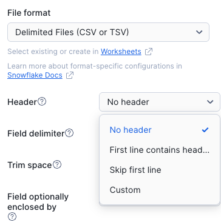
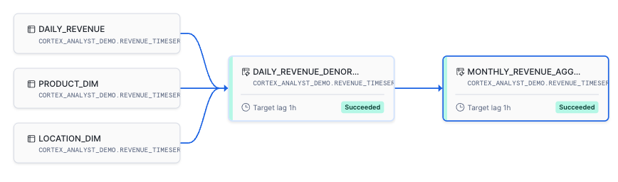

# Session 1b: Advanced Fundamentals (Optional - 45 minutes)

## Session Agenda

| # | Topic | Duration | Description |
|---|-------|----------|-------------|
| 1 | Environment Setup | 15 min | Create database, schema, warehouse, and load data |
| 2 | Streamlit with Cortex Code | 10 min | Use AI to generate a dynamic dashboard |
| 3 | Dynamic Tables | 15 min | Create automatic data transformation pipelines |
| 4 | Test Pipeline | 5 min | Insert new data and observe automatic updates |

> **📝 Note**: This is an optional session that introduces you to the revenue dataset, Cortex Code, and Dynamic Tables before diving into Cortex Analyst in Session 2.

---

## Part 1: Environment Setup

### Step 1: Create Database, Schema, and Warehouse

Create the foundational objects for the workshop:

```sql
USE ROLE ACCOUNTADMIN;

-- Create demo database
CREATE DATABASE IF NOT EXISTS cortex_analyst_demo;

-- Create schema
CREATE SCHEMA IF NOT EXISTS cortex_analyst_demo.revenue_timeseries;

-- Create warehouse
CREATE OR REPLACE WAREHOUSE cortex_analyst_wh
    WAREHOUSE_SIZE = 'small'
    WAREHOUSE_TYPE = 'standard'
    AUTO_SUSPEND = 60
    AUTO_RESUME = TRUE
    INITIALLY_SUSPENDED = TRUE
COMMENT = 'Warehouse for Cortex Analyst demo';

-- Enable cross-region inference (required for Cortex features)
ALTER ACCOUNT SET CORTEX_ENABLED_CROSS_REGION = 'ANY_REGION';
```

---

### Step 2: Create Table Structures

Define the fact and dimension tables for your revenue analytics model:

```sql
-- Dimension table: product_dim
CREATE OR REPLACE TABLE cortex_analyst_demo.revenue_timeseries.product_dim (
    product_id INT PRIMARY KEY,
    product_line VARCHAR
);

-- Dimension table: location_dim
CREATE OR REPLACE TABLE cortex_analyst_demo.revenue_timeseries.location_dim (
    location_id INT PRIMARY KEY,
    sales_region VARCHAR,
    state VARCHAR
);

-- Fact table: daily_revenue
CREATE OR REPLACE TABLE cortex_analyst_demo.revenue_timeseries.daily_revenue (
    date DATE,
    revenue FLOAT,
    cogs FLOAT,
    forecasted_revenue FLOAT,
    product_id INT,
    location_id INT,
    FOREIGN KEY (product_id) REFERENCES cortex_analyst_demo.revenue_timeseries.product_dim(product_id),
    FOREIGN KEY (location_id) REFERENCES cortex_analyst_demo.revenue_timeseries.location_dim(location_id)
);
```

**Data Model Design:**
- **Star Schema**: Fact table (DAILY_REVENUE) with dimension tables (PRODUCT_DIM, LOCATION_DIM)
- **Primary Keys**: LOCATION_DIM (location_id), PRODUCT_DIM (product_id)
- **Foreign Keys**: DAILY_REVENUE references both dimension tables

---

### Step 3: Download and Load CSV Files

**Download CSV Files:**
1. Download the following CSV files from the workshop data folder:
   - [`daily_revenue.csv`](data/daily_revenue.csv) (contains location_id references)
   - [`product.csv`](data/product.csv)
   - [`location.csv`](data/location.csv) (contains location_id, sales_region, and state)

**Load Files Using Snowsight UI:**

#### Load Product Dimension Data
1. Navigate to **Database Explorer** > `CORTEX_ANALYST_DEMO` > `REVENUE_TIMESERIES` > `Tables`
2. Click on the `PRODUCT_DIM` table
3. Click **Load Data** button
4. Select `product.csv` file from your downloads
5. Click **Next**
6. Click **Load** to import the data

#### Load Location Dimension Data
1. Click on the `LOCATION_DIM` table
2. Click **Load Data** button
3. Select `location.csv` file
4. Click **Next**
5. **⚠️ Important**: The file format may not automatically detect the header. Modify the file format settings:
   - Check the box for **"First line contains header"**
   
   

6. Verify the column mapping is correct:
   - `location_id` → `LOCATION_ID`
   - `sales_region` → `SALES_REGION`
   - `state` → `STATE`
7. Click **Load** to import the data

#### Load Daily Revenue Fact Data
1. Click on the `DAILY_REVENUE` table
2. Click **Load Data** button
3. Select `daily_revenue.csv` file
4. Click **Next**
5. The file should automatically detect the header and map columns correctly
6. Click **Load** to import the data

---

### Step 4: Verify Data Load

Validate that data has been loaded correctly:

```sql
USE SCHEMA CORTEX_ANALYST_DEMO.REVENUE_TIMESERIES;

-- Check row counts for all tables
SELECT 'DAILY_REVENUE' as table_name, COUNT(*) as row_count FROM daily_revenue
UNION ALL
SELECT 'PRODUCT_DIM', COUNT(*) FROM product_dim
UNION ALL
SELECT 'LOCATION_DIM', COUNT(*) FROM location_dim;

-- Preview data from each table
SELECT * FROM product_dim LIMIT 10;
SELECT * FROM location_dim ORDER BY location_id LIMIT 10;
SELECT * FROM daily_revenue LIMIT 10;
```

---

## Part 2: Create Streamlit Dashboard with Cortex Code

Now that the data is loaded, let's use **Cortex Code** to automatically generate a Streamlit dashboard!

### What is Cortex Code?

**Cortex Code** is Snowflake's AI-powered code assistant built directly into Snowsight. It can:
- Generate Python code for Streamlit apps
- Understand your data schema and relationships
- Create visualizations and interactive components
- Help you build dashboards without writing code from scratch

---

### Step 1: Create a New Streamlit App

1. Navigate to **Projects** > **Streamlit** in Snowsight
2. Click **+ Streamlit App**
3. Configure:
   - **App title**: `Dashboard`
   - **App location**: `CORTEX_ANALYST_DEMO`
   - **Schema**: `REVENUE_TIMESERIES`
   - **Python environment**: `Run on warehouse`
   - **App warehouse**: `COMPUTE_WH`
4. Click **Create**

---

### Step 2: Use Cortex Code to Generate the Dashboard

1. In the Streamlit editor, click on the **Cortex Code** icon (✨) in the **bottom right corner**
2. **Enter the following prompt:**

```
Create a beautiful and dynamic Streamlit dashboard to display sales data from the revenue_timeseries schema.
```

3. **Click Generate** or press Enter
4. Cortex Code will generate the complete dashboard code
5. **Copy the generated code**
6. **Replace** all the current Streamlit code with the generated code
7. Click **Run** to see your dashboard!

---

### Step 3: Explore Your Dashboard

Your AI-generated dashboard should now display:

✅ **Interactive Filters**: Select date ranges, regions, and products  
✅ **KPI Cards**: Key metrics at a glance  
✅ **Trend Charts**: Revenue over time  
✅ **Comparison Charts**: Revenue by region and product  
✅ **Data Table**: Detailed transaction records  

**Try These Interactions:**
- Filter by a specific region (e.g., "Europe")
- Select only certain product lines
- Change the date range to focus on a specific period
- Observe how all charts update dynamically

---

### Step 4: Customize with Cortex Code (Optional)

Want to enhance your dashboard? Use Cortex Code to add more features!

**Example prompts to try:**

1. **Add a profit margin chart:**
   ```
   Add a line chart showing profit margin percentage over time
   ```

2. **Add a geographic breakdown:**
   ```
   Add a chart showing revenue by state within each region
   ```

3. **Add forecasting accuracy:**
   ```
   Add a metric showing how accurate the forecasted revenue was compared to actual
   ```

4. **Improve styling:**
   ```
   Make the dashboard more visually appealing with custom colors and better layout
   ```

Simply open Cortex Code, enter your prompt, and let AI enhance your dashboard!

---

## Part 3: Dynamic Tables

Dynamic Tables automatically keep derived data up-to-date as source data changes. Let's create an automated incremental pipeline with two dynamic tables.

### Step 1: Use Cortex Code to Generate the Pipeline

1. Navigate to **Projects** > **Worksheets** in Snowsight
2. Click **+** to add a new SQL file
3. Click on the **Cortex Code** icon (✨) in the **bottom right corner**
4. **Enter the following prompt:**

```
Create an automated incremental pipeline for transformation using dynamic tables in the CORTEX_ANALYST_DEMO.REVENUE_TIMESERIES schema. 
Create two dynamic tables with incremental refresh:
1. First one will denormalize the data from DAILY_REVENUE, PRODUCT_DIM, and LOCATION_DIM tables
2. Second one will aggregate the revenue by month from the first dynamic table
Use COMPUTE_WH warehouse, 1 minute target lag, and INCREMENTAL refresh mode.
```

5. **Click Generate**
6. **Copy** the generated code and paste it into your SQL worksheet
7. **Run** the SQL to create the dynamic tables

**Expected Output:**

The generated code should look similar to this:

```sql
-- Dynamic Table 1: Denormalized revenue data with product and location details
CREATE OR REPLACE DYNAMIC TABLE CORTEX_ANALYST_DEMO.REVENUE_TIMESERIES.DAILY_REVENUE_DENORMALIZED
  TARGET_LAG = '1 minute'
  WAREHOUSE = COMPUTE_WH
  REFRESH_MODE = INCREMENTAL
  AS
    SELECT 
      dr.DATE,
      dr.REVENUE,
      dr.COGS,
      dr.FORECASTED_REVENUE,
      p.PRODUCT_ID,
      p.PRODUCT_LINE,
      l.LOCATION_ID,
      l.SALES_REGION,
      l.STATE
    FROM CORTEX_ANALYST_DEMO.REVENUE_TIMESERIES.DAILY_REVENUE dr
    INNER JOIN CORTEX_ANALYST_DEMO.REVENUE_TIMESERIES.PRODUCT_DIM p 
      ON dr.PRODUCT_ID = p.PRODUCT_ID
    INNER JOIN CORTEX_ANALYST_DEMO.REVENUE_TIMESERIES.LOCATION_DIM l 
      ON dr.LOCATION_ID = l.LOCATION_ID;

-- Dynamic Table 2: Monthly revenue aggregation
CREATE OR REPLACE DYNAMIC TABLE CORTEX_ANALYST_DEMO.REVENUE_TIMESERIES.MONTHLY_REVENUE_AGGREGATED
  TARGET_LAG = '1 minute'
  WAREHOUSE = COMPUTE_WH
  REFRESH_MODE = INCREMENTAL
  AS
    SELECT 
      DATE_TRUNC('MONTH', DATE) AS MONTH,
      PRODUCT_LINE,
      SALES_REGION,
      STATE,
      SUM(REVENUE) AS TOTAL_REVENUE,
      SUM(COGS) AS TOTAL_COGS,
      SUM(FORECASTED_REVENUE) AS TOTAL_FORECASTED_REVENUE,
      COUNT(*) AS TRANSACTION_COUNT
    FROM CORTEX_ANALYST_DEMO.REVENUE_TIMESERIES.DAILY_REVENUE_DENORMALIZED
    GROUP BY DATE_TRUNC('MONTH', DATE), PRODUCT_LINE, SALES_REGION, STATE;
```

**What This Creates:**
- **DAILY_REVENUE_DENORMALIZED**: Joins the three source tables into a single denormalized view
- **MONTHLY_REVENUE_AGGREGATED**: Aggregates the denormalized data by month, product line, region, and state
- **REFRESH_MODE = INCREMENTAL**: Only processes new/changed data, not the entire table
- **TARGET_LAG = '1 minute'**: Both tables refresh automatically within 1 minute of source changes
- **Pipeline Chain**: The second table depends on the first, creating an automatic transformation pipeline

---

### Step 2: Check the Lineage

After creating the dynamic tables, verify the data pipeline lineage:

1. Navigate to **Data** > **Databases** in Snowsight
2. Go to `CORTEX_ANALYST_DEMO` > `REVENUE_TIMESERIES`
3. Click on the `MONTHLY_REVENUE_AGGREGATED` dynamic table
4. Select the **Lineage** tab

You'll see the complete data flow:
- `DAILY_REVENUE`, `PRODUCT_DIM`, `LOCATION_DIM` → `DAILY_REVENUE_DENORMALIZED` → `MONTHLY_REVENUE_AGGREGATED`



This visual lineage confirms the pipeline dependencies and helps you understand how data flows through the transformation layers.

---

### Step 3: Verify the Dynamic Tables

```sql
-- Check the denormalized data
SELECT * FROM CORTEX_ANALYST_DEMO.REVENUE_TIMESERIES.DAILY_REVENUE_DENORMALIZED
LIMIT 20;

-- Check the monthly aggregation
SELECT * FROM CORTEX_ANALYST_DEMO.REVENUE_TIMESERIES.MONTHLY_REVENUE_AGGREGATED
ORDER BY MONTH DESC, TOTAL_REVENUE DESC
LIMIT 20;
```

---

### Step 4: Test the Pipeline with New Data

Let's insert new data and observe how both dynamic tables update automatically.

**Check Current State (Before):**

```sql
-- Check the most recent records in the denormalized table
SELECT * FROM CORTEX_ANALYST_DEMO.REVENUE_TIMESERIES.DAILY_REVENUE_DENORMALIZED 
ORDER BY DATE DESC;
```

**Insert New Data:**

```sql
-- Insert new revenue records for December 2024
INSERT INTO CORTEX_ANALYST_DEMO.REVENUE_TIMESERIES.DAILY_REVENUE 
    (date, revenue, cogs, forecasted_revenue, product_id, location_id)
VALUES 
    ('2024-12-15', 5000.00, 2500.00, 4800.00, 1, 1),
    ('2024-12-15', 7500.00, 3750.00, 7000.00, 2, 1),
    ('2024-12-15', 3200.00, 1600.00, 3000.00, 1, 2);
```

**Refresh and Observe the Update (After):**

```sql
-- Manually refresh the dynamic tables (or wait up to 1 minute for automatic refresh)
ALTER DYNAMIC TABLE CORTEX_ANALYST_DEMO.REVENUE_TIMESERIES.DAILY_REVENUE_DENORMALIZED REFRESH;
ALTER DYNAMIC TABLE CORTEX_ANALYST_DEMO.REVENUE_TIMESERIES.MONTHLY_REVENUE_AGGREGATED REFRESH;

-- Check the denormalized table - new records should appear at the top
SELECT * FROM CORTEX_ANALYST_DEMO.REVENUE_TIMESERIES.DAILY_REVENUE_DENORMALIZED 
ORDER BY DATE DESC;

-- Check the aggregated table - December 2024 totals should include the new data
SELECT * FROM CORTEX_ANALYST_DEMO.REVENUE_TIMESERIES.MONTHLY_REVENUE_AGGREGATED
WHERE MONTH = '2024-12-01'
ORDER BY TOTAL_REVENUE DESC;
```

**💡 Key Observations:**
- ✅ New data flows through the entire pipeline automatically
- ✅ DAILY_REVENUE_DENORMALIZED updates first with the joined data
- ✅ MONTHLY_REVENUE_AGGREGATED updates next with the aggregated results
- ✅ INCREMENTAL refresh only processes new/changed data
- ✅ No manual ETL or scheduled tasks required

---

### Step 5: Clean Up Test Data (Optional)

```sql
-- Remove the test records we inserted
DELETE FROM CORTEX_ANALYST_DEMO.REVENUE_TIMESERIES.DAILY_REVENUE 
WHERE date = '2024-12-15' AND revenue IN (5000.00, 7500.00, 3200.00);
```

---

## Session Summary

In this optional session, you've:

✅ **Set up the environment**: Created database, schema, and loaded revenue data  
✅ **Used Cortex Code**: Generated a complete Streamlit dashboard with AI  
✅ **Built interactive visualizations**: Charts, filters, and KPIs  
✅ **Created Dynamic Tables**: Automatic data transformation pipelines  
✅ **Tested real-time updates**: Inserted data and observed automatic refresh  

**Key Takeaways:**
- **Cortex Code** enables rapid development of data applications by translating natural language into working code
- **Dynamic Tables** keep derived data automatically up-to-date without manual ETL

---

## What's Next?

Now that you've explored the data with Streamlit and Dynamic Tables, you're ready for:

- **[Session 2: Building with Cortex Analyst](SESSION_2_CORTEX_ANALYST.md)** - Create a semantic model to enable natural language queries

> **💡 Note**: If you completed this session, you can skip Part 1 of Session 2 (Environment Setup) since the database and data are already loaded!

---

**Previous**: [Session 1: Snowflake Platform Fundamentals](SESSION_1_SNOWFLAKE_FUNDAMENTALS.md)  
**Next**: [Session 2: Building with Cortex Analyst](SESSION_2_CORTEX_ANALYST.md)
