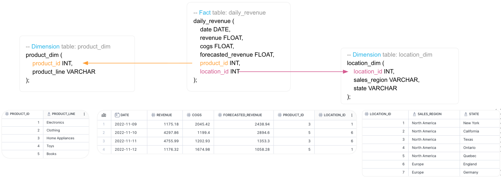
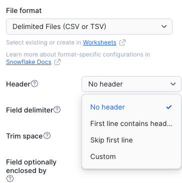
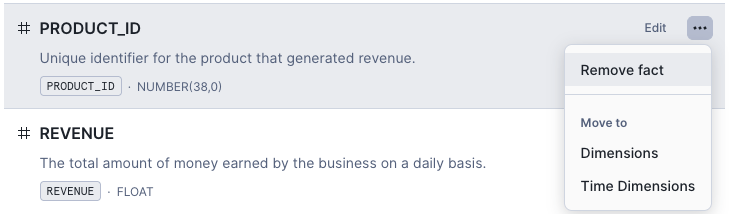
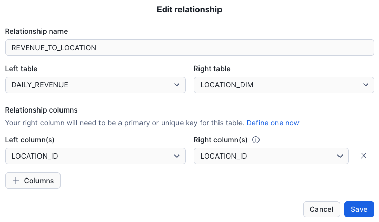

# Session 2: Building with Cortex Analyst - Quick Reference



## Part 1: Environment Setup

### Step 1: Create Database, Schema, and Warehouse

```sql
USE ROLE ACCOUNTADMIN;

-- Create database
CREATE DATABASE IF NOT EXISTS cortex_analyst_demo;

-- Create schema
CREATE SCHEMA IF NOT EXISTS cortex_analyst_demo.revenue_timeseries;

-- Create warehouse
CREATE OR REPLACE WAREHOUSE cortex_analyst_wh
    WAREHOUSE_SIZE = 'small'
    WAREHOUSE_TYPE = 'standard'
    AUTO_SUSPEND = 60
    AUTO_RESUME = TRUE
    INITIALLY_SUSPENDED = TRUE
COMMENT = 'Warehouse for Cortex Analyst demo';
```

---

### Step 2: Create Table Structures

```sql
-- Dimension table: product_dim
CREATE OR REPLACE TABLE cortex_analyst_demo.revenue_timeseries.product_dim (
    product_id INT PRIMARY KEY,
    product_line VARCHAR
);

-- Dimension table: location_dim
CREATE OR REPLACE TABLE cortex_analyst_demo.revenue_timeseries.location_dim (
    location_id INT PRIMARY KEY,
    sales_region VARCHAR,
    state VARCHAR
);

-- Fact table: daily_revenue
CREATE OR REPLACE TABLE cortex_analyst_demo.revenue_timeseries.daily_revenue (
    date DATE,
    revenue FLOAT,
    cogs FLOAT,
    forecasted_revenue FLOAT,
    product_id INT,
    location_id INT,
    FOREIGN KEY (product_id) REFERENCES cortex_analyst_demo.revenue_timeseries.product_dim(product_id),
    FOREIGN KEY (location_id) REFERENCES cortex_analyst_demo.revenue_timeseries.location_dim(location_id)
);
```

---

### Step 3: Load CSV Files via Snowsight UI

**Download CSV files from workshop data folder:**
- `daily_revenue.csv`
- `product.csv`
- `location.csv`

**Load Product Dimension:**
1. Navigate to **Database Explorer** > `CORTEX_ANALYST_DEMO` > `REVENUE_TIMESERIES` > `Tables`
2. Click on `PRODUCT_DIM` table
3. Click **Load Data** → Select `product.csv`
4. Click **Next** → Click **Load**

**Load Location Dimension:**
1. Click on `LOCATION_DIM` table
2. Click **Load Data** → Select `location.csv`
3. Click **Next**
4. **⚠️ Important**: The file format may not automatically detect the header. Modify the file format settings:
   - Check the box for **"First line contains header"**
   
   

5. Verify the column mapping is correct:
   - `location_id` → `LOCATION_ID`
   - `sales_region` → `SALES_REGION`
   - `state` → `STATE`
6. Click **Load**

**Load Daily Revenue Fact:**
1. Click on `DAILY_REVENUE` table
2. Click **Load Data** → Select `daily_revenue.csv`
3. Click **Next** → Click **Load**

---

### Step 4: Verify Data Load

```sql
USE SCHEMA CORTEX_ANALYST_DEMO.REVENUE_TIMESERIES;

-- Check row counts
SELECT 'DAILY_REVENUE' as table_name, COUNT(*) as row_count FROM daily_revenue
UNION ALL
SELECT 'PRODUCT_DIM', COUNT(*) FROM product_dim
UNION ALL
SELECT 'LOCATION_DIM', COUNT(*) FROM location_dim;

-- Preview data
SELECT * FROM product_dim LIMIT 10;
SELECT * FROM location_dim ORDER BY location_id LIMIT 10;
SELECT * FROM daily_revenue LIMIT 10;
```

---

## Part 2: Semantic Model Development

### Step 1: Create Semantic View

1. Go to **AI & ML** > **Cortex Analyst**
2. Click **Create New** > **Create New Semantic View**
3. Name: `REVENUE_TIMESERIES`
4. Schema: `CORTEX_ANALYST_DEMO.REVENUE_TIMESERIES`
5. Select tables: `DAILY_REVENUE`, `PRODUCT_DIM`, `LOCATION_DIM`
6. Include **all columns** from selected tables
7. Click **Create** and **Save**

---

### Step 2: Configure Column Types

**Fix DAILY_REVENUE Table:**
- Change `PRODUCT_ID` from "Fact" → "Dimension"


- Change `LOCATION_ID` from "Fact" → "Dimension"

**Fix LOCATION_DIM Table:**
- Change `LOCATION_ID` from "Fact" → "Dimension"

**Fix PRODUCT_DIM Table:**
- Change `PRODUCT_ID` from "Fact" → "Dimension"

---

### Step 3: Define Relationships

**Relationship 1: Revenue to Product**


```yaml
- name: revenue_to_product
  left_table: DAILY_REVENUE
  relationship_columns:
    - left_column: PRODUCT_ID
      right_column: PRODUCT_ID
  right_table: PRODUCT_DIM
```

**Relationship 2: Revenue to Location**




```yaml
- name: revenue_to_location
  left_table: DAILY_REVENUE
  relationship_columns:
    - left_column: LOCATION_ID
      right_column: LOCATION_ID
  right_table: LOCATION_DIM
```

---

### Step 4: Test First Join Query

**Test Question:**
> "What is the total cost of goods sold for the Electronics product line?"

**Expected Result:** 212,458.25

---

### Step 5: Add Verified Query

1. In **Playground** tab, enter: "Sales revenue for product categories sold in Europe in 2024 & YoY % Growth"
2. Click **Run**
3. Click **+ Verified Query**
4. Click **Save and Continue**

---

### Step 6: Add Profit Metric

1. Select **DAILY_REVENUE** table
2. Scroll to **Metrics** section
3. Click **+ Add Metric**
4. Configure:
   - **Expression**: `SUM(REVENUE - (0.01 * REVENUE) - COGS)`
   - **Metric Name**: `Profit`
   - **Description**: `The profit generated from sales after deducting 1% processing fee and cost of goods sold`
   - **Synonyms**: `earnings`, `margin`, `net income`
5. Click **Save**

**Test:** Ask "Monthly profit in Europe per category" and verify the formula is used.

---

### Step 7: Add Large Orders Filter

1. Select **DAILY_REVENUE** table
2. Scroll to **Filters** section
3. Click **+ Add Filter**
4. Configure:
   - **Expression**: `REVENUE >= 1150`
   - **Filter Name**: `large_order`
   - **Description**: `Orders with revenue equal to or greater than 1150`
   - **Synonyms**: `large orders`, `big orders`, `high value orders`
5. Click **Add**

**Test:** Ask "list large orders" and verify the filter is applied.

---

### Step 8: Add Custom Instructions

1. Scroll to **Custom Instructions** section
2. In **SQL generation** field, add:

```
Ensure that all numeric columns are rounded to 1 decimal point in the output.
For any percentage or rate calculation, multiply the result by 100.
If no date filter is provided, apply a filter for the last year.
```

**Test:** Ask "Percentage of Revenue per Region" and verify formatting and date filter.

---

### Step 9: Save Semantic Model

1. Click **Save** button at top right
2. Your semantic model is now ready!

---

**Previous**: [Session 1: Snowflake Platform Fundamentals](SESSION_1_SNOWFLAKE_FUNDAMENTALS_LIGHT.md)  
**Next**: [Session 3: Cortex Search Integration (Optional)](SESSION_3_CORTEX_SEARCH_INTEGRATION_LIGHT.md) | [Session 4: Snowflake Intelligence](SESSION_4_SNOWFLAKE_INTELLIGENCE_LIGHT.md)

