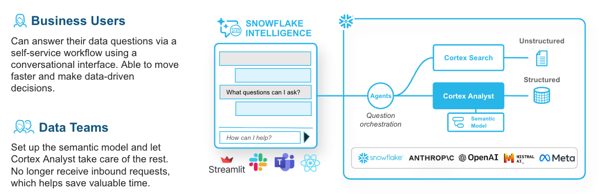
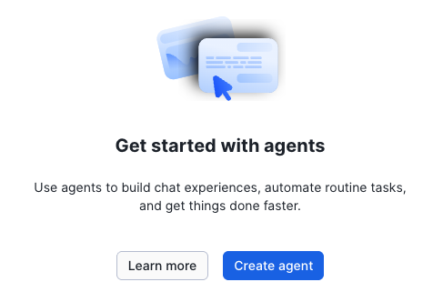

# Session 4: Snowflake Intelligence (30 minutes)

## What is Snowflake Intelligence?

**Snowflake Intelligence** is Snowflake's AI-powered assistant that provides a unified, conversational interface to interact with your entire Snowflake environment. It combines natural language understanding with intelligent tool orchestration to help users get insights, automate workflows, and manage their data platform.



**Key Capabilities:**
- **Conversational Analytics**: Ask questions across all your data using natural language
- **Intelligent Tool Orchestration**: Automatically selects and chains the right AI services (Cortex Analyst, Cortex Search, etc.)
- **Contextual Understanding**: Maintains conversation context and learns from your interactions
- **Platform Integration**: Seamlessly integrates with your semantic models, data, and Snowflake features

**How It Works:**
1. You interact with Snowflake Intelligence through a chat interface in Snowsight
2. Ask questions or request actions in natural language
3. Intelligence analyzes your request and determines the best tools to use
4. Orchestrates multiple Snowflake services as needed (Cortex Analyst for data queries, Cortex Search for semantic search, etc.)
5. Returns comprehensive answers with context and explanations
6. Maintains conversation history for follow-up questions

**What Makes It Different:**
- **Beyond Cortex Analyst**: While Cortex Analyst focuses on structured data queries, Snowflake Intelligence can help with platform tasks, documentation, troubleshooting, and more
- **Multi-Tool Orchestration**: Automatically combines different AI services based on your needs
- **Unified Experience**: One interface for all your Snowflake AI capabilities

In this session, you'll explore how Snowflake Intelligence and Agents extend your Cortex Analyst capabilities to create sophisticated, automated analytics workflows.

---

## Part 1: Snowflake Agents (10 minutes)

### What are Snowflake Agents?

Snowflake Agents are AI-powered assistants that can:
- **Orchestrate Multiple Tools**: Combine Cortex Analyst with other capabilities
- **Chain Actions**: Execute multi-step workflows automatically
- **Integrate External Systems**: Connect to APIs, send notifications, trigger actions
- **Learn from Context**: Understand user intent and adapt responses

Think of agents as intelligent coordinators that can analyze data, make decisions, and take action—all through natural language.

---

### Setup Snowflake Intelligence

Before creating agents, you need to set up the required database and schema structure. Run the following SQL commands:

```sql
USE ROLE ACCOUNTADMIN;

-- 1. Create database for Snowflake Intelligence configuration
CREATE DATABASE IF NOT EXISTS snowflake_intelligence;
GRANT USAGE ON DATABASE snowflake_intelligence TO ROLE PUBLIC;

-- 2. Create schema to store agents
CREATE SCHEMA IF NOT EXISTS snowflake_intelligence.agents;
GRANT USAGE ON SCHEMA snowflake_intelligence.agents TO ROLE PUBLIC;

-- 3. Grant CREATE AGENT privilege to your role
GRANT CREATE AGENT ON SCHEMA snowflake_intelligence.agents TO ROLE ACCOUNTADMIN;

-- 4. Set default role and warehouse for your user (required for Snowflake Intelligence)
ALTER USER admin SET DEFAULT_ROLE = ACCOUNTADMIN;
ALTER USER admin SET DEFAULT_WAREHOUSE = cortex_analyst_wh;
```

**What This Does:**
- Creates a dedicated `snowflake_intelligence` database for agent configuration
- Creates an `agents` schema to store all agent definitions
- Grants appropriate privileges for agent creation and access
- Makes agents discoverable to all users with PUBLIC role
- Sets your default role and warehouse (required for Snowflake Intelligence to work)

**Important Notes:**
- By default, Snowflake Intelligence uses the user's default role and default warehouse
- All queries from Snowflake Intelligence use the user's credentials
- Role-based access control (RBAC) and data masking policies automatically apply to all agent interactions

For more details, see the [Snowflake Intelligence documentation](https://docs.snowflake.com/en/user-guide/snowflake-cortex/snowflake-intelligence).

---

### Create Your First AI Agent

Navigate to **AI & ML** > **Agents** in Snowsight and click **+ Agent** to create your first AI agent.



**Agent Configuration:**

1. **Agent object name**: `revenue_analyst_agent`
2. **Display name**: `Revenue Analyst Agent`
3. **Warehouse**: Select `cortex_analyst_wh` (compute resources for agent operations)
4. **Description**: `AI agent for analyzing revenue data and answering business questions`
5. **Instructions**: System prompts to guide agent behavior:
   ```
   You are a helpful revenue data analyst. Use the Cortex Analyst tool to answer 
   questions about revenue, products, and regional performance. Provide clear, 
   concise answers with relevant data insights.
   ```

Click **Create agent** to complete the initial setup

---

### Step 2: Add Cortex Analyst Tool to Agent

Integrate your semantic model as a tool the agent can use:

```sql
ALTER AGENT revenue_analyst_agent
  ADD TOOL cortex_analyst_tool
  TYPE = CORTEX_ANALYST
  PARAMETERS = (
    SEMANTIC_MODEL = '@cortex_analyst_demo.revenue_timeseries.raw_data/revenue_timeseries.yaml'
  )
  DESCRIPTION = 'Query revenue, product, and regional data using natural language';
```

**Tool Configuration:**
- **Type**: CORTEX_ANALYST indicates this tool uses your semantic model
- **Parameters**: Points to your semantic model YAML file
- **Description**: Helps the agent understand when to use this tool

---

### Step 3: Add Custom Email Tool

Create a tool that can send email notifications with analysis results:

```sql
-- First, create a Python UDF for sending emails
CREATE OR REPLACE FUNCTION send_email_notification(
    recipient STRING,
    subject STRING,
    body STRING
)
RETURNS STRING
LANGUAGE PYTHON
RUNTIME_VERSION = '3.11'
HANDLER = 'send_email'
PACKAGES = ('snowflake-snowpark-python')
AS
$$
def send_email(recipient, subject, body):
    # In production, integrate with your email service (SendGrid, AWS SES, etc.)
    # For demo purposes, we'll return a confirmation message
    confirmation = f"Email sent to {recipient}\nSubject: {subject}\nBody: {body}"
    return confirmation
$$;

-- Add email tool to agent
ALTER AGENT revenue_analyst_agent
  ADD TOOL email_notification_tool
  TYPE = FUNCTION
  PARAMETERS = (
    FUNCTION_NAME = 'send_email_notification',
    DESCRIPTION = 'Send email notifications with analysis results'
  )
  DESCRIPTION = 'Use this tool when the user requests to send or share analysis results via email';
```

**Custom Tool Types:**
- **FUNCTION**: Python/Java UDFs
- **PROCEDURE**: Stored procedures
- **EXTERNAL_FUNCTION**: API integrations
- **CORTEX_ANALYST**: Semantic model queries

---

### Step 4: Test Your Agent

#### Simple Query
```sql
-- Test basic data query
SELECT SNOWFLAKE.CORTEX.AGENT_CHAT(
  'revenue_analyst_agent',
  'What was the total revenue in December 2023?'
);
```

#### Multi-Tool Orchestration
```sql
-- Test tool chaining
SELECT SNOWFLAKE.CORTEX.AGENT_CHAT(
  'revenue_analyst_agent',
  'Analyze revenue by product line for Q4 2023 and email the results to sales-team@company.com'
);
```

**Expected Behavior:**
1. Agent analyzes the question
2. Uses Cortex Analyst tool to query revenue data
3. Formats the results
4. Uses email tool to send notification
5. Returns confirmation to user

---

### Step 5: Advanced Agent Patterns

#### Conditional Logic
```sql
ALTER AGENT revenue_analyst_agent
  SET INSTRUCTIONS = $$
    You are a revenue analyst assistant.
    
    When analyzing revenue data:
    - If revenue < $10,000, flag as "low performance"
    - If revenue > $100,000, flag as "high performance"
    - Always include comparisons to previous periods
    
    When sending emails:
    - For executives, provide high-level summaries
    - For analysts, include detailed breakdowns
    - Always include data visualization recommendations
  $$;
```

#### Error Handling
```sql
ALTER AGENT revenue_analyst_agent
  SET INSTRUCTIONS = $$
    If Cortex Analyst returns no data:
    - Suggest alternative date ranges or filters
    - Check if the question needs clarification
    
    If a tool fails:
    - Inform the user clearly
    - Suggest alternative approaches
    - Don't make up data
  $$;
```

---

### Use Cases for Agents

**1. Automated Reporting**
- Daily/weekly revenue summaries sent automatically
- Alert stakeholders when KPIs exceed thresholds
- Generate and distribute periodic reports

**2. Interactive Dashboards**
- Answer follow-up questions based on visualizations
- Drill down into specific metrics
- Provide context and explanations

**3. Data Discovery**
- Guide users to relevant datasets
- Suggest related questions
- Explain data relationships

**4. Workflow Automation**
- Trigger actions based on data conditions
- Create tickets for anomalies
- Update external systems

---

## Part 2: Snowflake Intelligence Capabilities (15 minutes)

### What is Snowflake Intelligence?

Snowflake Intelligence is an integrated AI layer that provides:
- **Conversational Analytics**: Natural language interaction across the platform
- **Intelligent Tool Orchestration**: Automatic tool selection and chaining
- **Contextual Understanding**: Learn from user patterns and preferences
- **Visualization Recommendations**: Suggest optimal chart types

---

### Feature 1: Conversational Analytics

#### Access Snowflake Intelligence

Navigate to the **Intelligence** icon in Snowsight (chat bubble in the top right)

#### Example Interactions

**Simple Questions:**
```
You: "What's our best performing product?"
Intelligence: [Queries data, returns answer with chart]
```

**Follow-up Questions:**
```
You: "Show me the trend over time"
Intelligence: [Understands context, creates time series visualization]
```

**Complex Analysis:**
```
You: "Compare that to the worst performing product and explain the difference"
Intelligence: [Analyzes both products, generates comparative insights]
```

---

### Feature 2: Intelligent Tool Orchestration

Snowflake Intelligence automatically determines which tools to use and in what order:

#### Multi-Step Query Example

**User Question:**
```
"Analyze Q4 revenue by region, identify underperforming areas, 
and create a plan to improve them"
```

**Intelligence Orchestration:**
1. **Tool: Cortex Analyst**
   - Query Q4 revenue by region
   - Calculate performance metrics

2. **Tool: Cortex LLM**
   - Identify underperforming regions
   - Analyze potential causes

3. **Tool: Cortex Complete**
   - Generate improvement recommendations
   - Create action plan

4. **Tool: Document AI**
   - Format results as structured document
   - Include visualizations

**Result:** Comprehensive analysis with actionable insights, automatically orchestrated

---

### Feature 3: Automatic Chart Generation

Intelligence analyzes your data and recommends the most effective visualizations:

#### Visualization Selection Logic

| Data Pattern | Recommended Chart | Use Case |
|-------------|-------------------|----------|
| Time series | Line chart | Trends over time |
| Categories | Bar chart | Comparative analysis |
| Part-to-whole | Pie chart | Market share, composition |
| Correlation | Scatter plot | Relationship analysis |
| Distribution | Histogram | Data distribution |
| Geographic | Map | Regional analysis |

#### Example Interaction

```
You: "Show me revenue by product line"
Intelligence: 
- Detects categorical data
- Creates bar chart
- Sorts by value descending
- Adds percentage labels
```

---

### Feature 4: Contextual Understanding

Intelligence maintains conversation context and learns from interactions:

#### Context Retention

**Conversation Flow:**
```
You: "What was revenue in December?"
Intelligence: [Returns December revenue: $1.2M]

You: "How does that compare to November?"
Intelligence: [Understands "that" refers to December, compares to November]

You: "Show me the top products for both months"
Intelligence: [Remembers both months, shows product breakdown]
```

#### Learning from Patterns

- Remembers frequently asked questions
- Suggests related queries
- Adapts to user preferences (chart types, detail level)
- Improves accuracy over time

---

### Feature 5: Natural Language Data Discovery

Intelligence can help you explore and understand your data:

#### Discovery Questions

```
You: "What data do I have access to?"
Intelligence: [Lists databases, schemas, and tables with descriptions]

You: "What can I analyze about revenue?"
Intelligence: [Shows available metrics, dimensions, time ranges]

You: "What's interesting in the data?"
Intelligence: [Identifies trends, anomalies, patterns]
```

---

## Advanced Workflows

### Workflow 1: Automated Anomaly Detection

```sql
-- Create agent for anomaly monitoring
CREATE AGENT anomaly_detector
  WAREHOUSE = cortex_analyst_wh
  INSTRUCTIONS = $$
    Monitor daily revenue data.
    If revenue deviates > 20% from forecast, analyze root cause and notify management.
  $$;

ALTER AGENT anomaly_detector
  ADD TOOL cortex_analyst_tool TYPE = CORTEX_ANALYST
  ADD TOOL alert_tool TYPE = FUNCTION;

-- Schedule agent to run daily
CREATE TASK daily_anomaly_check
  WAREHOUSE = cortex_analyst_wh
  SCHEDULE = 'USING CRON 0 8 * * * UTC'
AS
  SELECT SNOWFLAKE.CORTEX.AGENT_CHAT(
    'anomaly_detector',
    'Check for revenue anomalies in the past 24 hours'
  );
```

---

### Workflow 2: Executive Summary Generation

```sql
-- Weekly executive briefing
SELECT SNOWFLAKE.CORTEX.AGENT_CHAT(
  'revenue_analyst_agent',
  $$
  Create a weekly executive summary including:
  1. Total revenue vs target
  2. Top 3 performing products
  3. Regional performance comparison
  4. Key trends and insights
  5. Recommendations for next week
  
  Email the summary to exec-team@company.com
  $$
);
```

---

### Workflow 3: Interactive Report Builder

```sql
-- User-driven report creation
SELECT SNOWFLAKE.CORTEX.AGENT_CHAT(
  'revenue_analyst_agent',
  $$
  I need a report on DAPS region performance.
  Include revenue trends, top products, and YoY growth.
  Format it professionally and make it sharable.
  $$
);
```

---

## Best Practices for Production

### 1. Agent Design
- **Clear Instructions**: Provide specific, unambiguous guidance
- **Error Handling**: Define fallback behaviors
- **Tool Descriptions**: Help agent choose correct tool
- **Security**: Limit tool permissions appropriately

### 2. Performance Optimization
- **Caching**: Cache frequently requested analyses
- **Warehouse Sizing**: Right-size compute for workload
- **Query Optimization**: Use verified queries for common patterns
- **Rate Limiting**: Control agent execution frequency

### 3. User Experience
- **Response Time**: Set expectations (simple vs complex queries)
- **Feedback Loops**: Allow users to refine questions
- **Documentation**: Provide example questions
- **Training**: Help users understand agent capabilities

### 4. Governance
- **Access Control**: Restrict sensitive data appropriately
- **Audit Logging**: Track agent usage and decisions
- **Version Control**: Manage semantic model changes
- **Testing**: Validate agent behavior regularly

---

## Real-World Use Cases

### Financial Services
- **Risk Analysis**: Automated portfolio risk assessment
- **Fraud Detection**: Real-time anomaly detection and alerting
- **Regulatory Reporting**: Automated compliance report generation

### Retail
- **Inventory Optimization**: Predict stockouts and overstock situations
- **Customer Analytics**: Segment analysis and personalization
- **Pricing Optimization**: Dynamic pricing recommendations

### Healthcare
- **Patient Outcomes**: Analyze treatment effectiveness
- **Resource Planning**: Optimize staffing and equipment
- **Claims Processing**: Automated claim analysis and routing

### Manufacturing
- **Quality Control**: Defect prediction and root cause analysis
- **Predictive Maintenance**: Equipment failure prediction
- **Supply Chain**: Optimize inventory and logistics

---

## Session Summary

In this session, you've learned:

✅ **Snowflake Agents**: Create AI assistants that orchestrate multiple tools  
✅ **Cortex Analyst Integration**: Add semantic models as agent tools  
✅ **Custom Tools**: Build email, API, and workflow integrations  
✅ **Tool Orchestration**: Automatic multi-step workflow execution  
✅ **Snowflake Intelligence**: Conversational analytics across the platform  
✅ **Contextual AI**: Context retention and learning capabilities  
✅ **Visualization**: Automatic chart generation and recommendations  
✅ **Production Patterns**: Best practices for enterprise deployment  

You now have the knowledge to build sophisticated AI-powered analytics solutions!

---

## Hands-On Exercises

Try these exercises to reinforce your learning:

### Exercise 1: Create a Sales Agent
Build an agent that can analyze sales data and send reports to stakeholders.

### Exercise 2: Implement Anomaly Alerts
Set up automated monitoring for unusual patterns in your data.

### Exercise 3: Build a Discovery Tool
Create an agent that helps users explore available datasets and ask relevant questions.

### Exercise 4: Multi-Region Analysis
Use Intelligence to compare performance across all regions and identify opportunities.

---

## Additional Resources

- [Snowflake Agents Documentation](https://docs.snowflake.com/en/user-guide/agents)
- [Snowflake Intelligence Guide](https://docs.snowflake.com/en/user-guide/intelligence)
- [Tool Orchestration Patterns](https://docs.snowflake.com/en/user-guide/agents-orchestration)
- [Production Deployment Guide](https://docs.snowflake.com/en/user-guide/agents-production)

---

## Workshop Wrap-Up

Congratulations! You've completed the Snowflake Cortex Analyst Workshop.

### What You've Learned
1. **Snowflake Platform**: Core capabilities and architecture
2. **Cortex Analyst**: Semantic model development and natural language queries
3. **Snowflake Intelligence**: Advanced AI orchestration and automation

### Next Steps
- Deploy your semantic model to production
- Build custom agents for your organization
- Explore additional Cortex AI features
- Join the Snowflake community

### Stay Connected
- [Snowflake Community Forums](https://community.snowflake.com)
- [Cortex AI Resources](https://www.snowflake.com/cortex)
- [Quickstarts and Tutorials](https://quickstarts.snowflake.com)

---

**Previous**: [Session 2: Building with Cortex Analyst](SESSION_2_CORTEX_ANALYST.md) | [Session 3: Cortex Search Integration (Optional)](SESSION_3_CORTEX_SEARCH_INTEGRATION.md)  
**Back to Main**: [Workshop Overview](README.md)

