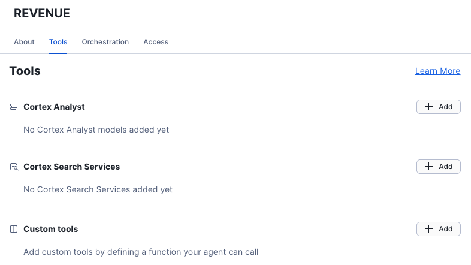
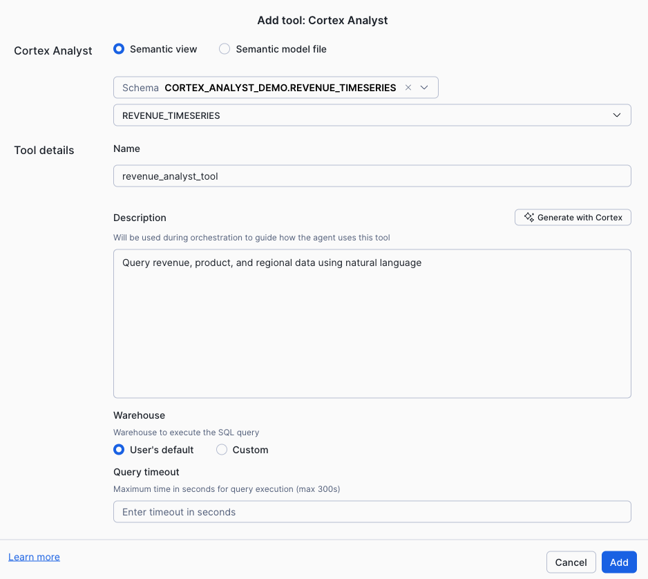
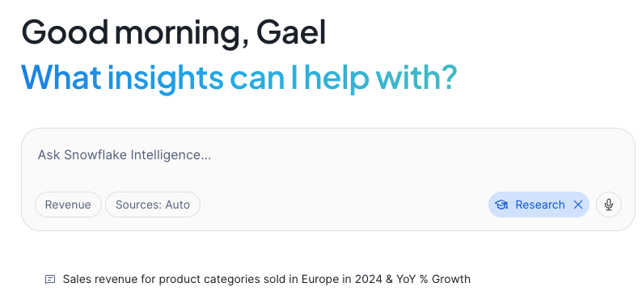
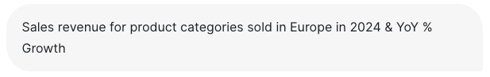

# Session 4: Snowflake Intelligence (30 minutes)

## What is Snowflake Intelligence?

**Snowflake Intelligence** is Snowflake's AI-powered assistant that provides a unified, conversational interface to interact with your entire Snowflake environment. It combines natural language understanding with intelligent tool orchestration to help users get insights, automate workflows, and manage their data platform.


**Key Capabilities:**
- **Conversational Analytics**: Ask questions across all your data using natural language
- **Intelligent Tool Orchestration**: Automatically selects and chains the right AI services (Cortex Analyst, Cortex Search, etc.)
- **Contextual Understanding**: Maintains conversation context and learns from your interactions
- **Platform Integration**: Seamlessly integrates with your semantic models, data, and Snowflake features

**How It Works:**
1. You interact with Snowflake Intelligence through a chat interface in Snowsight
2. Ask questions or request actions in natural language
3. Intelligence analyzes your request and determines the best tools to use
4. Orchestrates multiple Snowflake services as needed (Cortex Analyst for data queries, Cortex Search for semantic search, etc.)
5. Returns comprehensive answers with context and explanations
6. Maintains conversation history for follow-up questions

**What Makes It Different:**
- **Beyond Cortex Analyst**: While Cortex Analyst focuses on structured data queries, Snowflake Intelligence can help with platform tasks, documentation, troubleshooting, and more
- **Multi-Tool Orchestration**: Automatically combines different AI services based on your needs
- **Unified Experience**: One interface for all your Snowflake AI capabilities

In this session, you'll explore how Snowflake Intelligence and Agents extend your Cortex Analyst capabilities to create sophisticated, automated analytics workflows.

---

## Part 1: Snowflake Agents (10 minutes)

### What are Snowflake Agents?

Snowflake Agents are AI-powered assistants that can:
- **Orchestrate Multiple Tools**: Combine Cortex Analyst with other capabilities
- **Chain Actions**: Execute multi-step workflows automatically
- **Integrate External Systems**: Connect to APIs, send notifications, trigger actions
- **Learn from Context**: Understand user intent and adapt responses

Think of agents as intelligent coordinators that can analyze data, make decisions, and take action—all through natural language.

---

### Setup Snowflake Intelligence

Before creating agents, you need to set up the required database and schema structure. Run the following SQL commands:

```sql
USE ROLE ACCOUNTADMIN;

-- 1. Create database for Snowflake Intelligence configuration
CREATE DATABASE IF NOT EXISTS snowflake_intelligence;
GRANT USAGE ON DATABASE snowflake_intelligence TO ROLE PUBLIC;

-- 2. Create schema to store agents
CREATE SCHEMA IF NOT EXISTS snowflake_intelligence.agents;
GRANT USAGE ON SCHEMA snowflake_intelligence.agents TO ROLE PUBLIC;

-- 3. Grant CREATE AGENT privilege to your role
GRANT CREATE AGENT ON SCHEMA snowflake_intelligence.agents TO ROLE ACCOUNTADMIN;

-- 4. Set default role and warehouse for your user (required for Snowflake Intelligence)
ALTER USER admin SET DEFAULT_ROLE = ACCOUNTADMIN;
ALTER USER admin SET DEFAULT_WAREHOUSE = cortex_analyst_wh;

-- 5. Enable cross-region inference (required for Snowflake Intelligence)
ALTER ACCOUNT SET CORTEX_ENABLED_CROSS_REGION = 'ANY_REGION';
```

**What This Does:**
- Creates a dedicated `snowflake_intelligence` database for agent configuration
- Creates an `agents` schema to store all agent definitions
- Grants appropriate privileges for agent creation and access
- Makes agents discoverable to all users with PUBLIC role
- Sets your default role and warehouse (required for Snowflake Intelligence to work)
- Enables cross-region inference to allow Cortex AI features to work across regions

**Important Notes:**
- By default, Snowflake Intelligence uses the user's default role and default warehouse
- All queries from Snowflake Intelligence use the user's credentials
- Role-based access control (RBAC) and data masking policies automatically apply to all agent interactions

For more details, see the [Snowflake Intelligence documentation](https://docs.snowflake.com/en/user-guide/snowflake-cortex/snowflake-intelligence).

---

### Create Your First AI Agent

Navigate to **AI & ML** > **Agents** in Snowsight and click **Create agent**.


**Step 1: Create the Agent**

Provide the following details:
- **Agent object name**: `revenue_analyst_agent`
- **Display name**: `Revenue Analyst Agent`

Click **Create agent** to initialize your agent.

**Step 2: Configure the Agent**

Once the agent is created, click on it to open the details page, then click **Edit** to configure:

1. **Description**: 
   ```
   AI agent for analyzing revenue data and answering business questions
   ```

2. **Test Question**:
   ```
   Sales revenue for product categories sold in Europe in 2024 & YoY % Growth
   ```

Add your question.

**Step 3: Add Cortex Analyst Tool to Agent**

Navigate to the **Tools** tab in your agent configuration and click **+ Add** to integrate your Cortex Analyst semantic model.


**Tool Configuration:**

1. **Tool Type**: Select **Semantic view**
2. **Database**: Select `CORTEX_ANALYST_DEMO`
3. **Schema**: Select `REVENUE_TIMESERIES`
4. **Semantic view**: Select `REVENUE_TIMESERIES`
5. **Tool name**: `revenue_analyst_tool`
6. **Description**: `Query revenue, product, and regional data using natural language`



Click **Add** to attach the tool to your agent, then **Save** your agent configuration

**Step 4: Test Your Agent in Snowflake Intelligence**

Now that your agent is configured with the Cortex Analyst tool, let's test it!

1. Navigate to **AI & ML** > **Snowflake Intelligence** in Snowsight
2. Your `Revenue Analyst Agent` should appear in the available agents
3. Click on the **test question** you configured earlier:
   ```
   Sales revenue for product categories sold in Europe in 2024 & YoY % Growth
   ```



The agent will use the Cortex Analyst tool to query your semantic model and provide a detailed answer with revenue data and year-over-year growth analysis for European product categories.




---

### Add Custom Email Tool (Optional)

Create a tool that can send email notifications with analysis results:

```sql
-- First, create a Python UDF for sending emails
CREATE OR REPLACE FUNCTION send_email_notification(
    recipient STRING,
    subject STRING,
    body STRING
)
RETURNS STRING
LANGUAGE PYTHON
RUNTIME_VERSION = '3.11'
HANDLER = 'send_email'
PACKAGES = ('snowflake-snowpark-python')
AS
$$
def send_email(recipient, subject, body):
    # In production, integrate with your email service (SendGrid, AWS SES, etc.)
    # For demo purposes, we'll return a confirmation message
    confirmation = f"Email sent to {recipient}\nSubject: {subject}\nBody: {body}"
    return confirmation
$$;

-- Add email tool to agent
ALTER AGENT revenue_analyst_agent
  ADD TOOL email_notification_tool
  TYPE = FUNCTION
  PARAMETERS = (
    FUNCTION_NAME = 'send_email_notification',
    DESCRIPTION = 'Send email notifications with analysis results'
  )
  DESCRIPTION = 'Use this tool when the user requests to send or share analysis results via email';
```

**Custom Tool Types:**
- **FUNCTION**: Python/Java UDFs
- **PROCEDURE**: Stored procedures
- **EXTERNAL_FUNCTION**: API integrations
- **CORTEX_ANALYST**: Semantic model queries

---

## Part 2: Snowflake Intelligence Capabilities (15 minutes)

### What is Snowflake Intelligence?

Snowflake Intelligence is an integrated AI layer that provides:
- **Conversational Analytics**: Natural language interaction across the platform
- **Intelligent Tool Orchestration**: Automatic tool selection and chaining
- **Contextual Understanding**: Learn from user patterns and preferences
- **Visualization Recommendations**: Suggest optimal chart types

---

## Session Summary

In this session, you've learned:

✅ **Snowflake Agents**: Create AI assistants that orchestrate multiple tools  
✅ **Cortex Analyst Integration**: Add semantic models as agent tools  
✅ **Custom Tools**: Build email, API, and workflow integrations  
✅ **Tool Orchestration**: Automatic multi-step workflow execution  
✅ **Snowflake Intelligence**: Conversational analytics across the platform  
✅ **Contextual AI**: Context retention and learning capabilities  
✅ **Visualization**: Automatic chart generation and recommendations  
✅ **Production Patterns**: Best practices for enterprise deployment  

You now have the knowledge to build sophisticated AI-powered analytics solutions!

---

## Workshop Wrap-Up

Congratulations! You've completed the Snowflake Cortex Analyst Workshop.

### What You've Learned
1. **Snowflake Platform**: Core capabilities and architecture
2. **Cortex Analyst**: Semantic model development and natural language queries
3. **Snowflake Intelligence**: Advanced AI orchestration and automation

---

**Previous**: [Session 2: Building with Cortex Analyst](SESSION_2_CORTEX_ANALYST.md) | [Session 3: Cortex Search Integration (Optional)](SESSION_3_CORTEX_SEARCH_INTEGRATION.md)  
**Back to Main**: [Workshop Overview](README.md)

