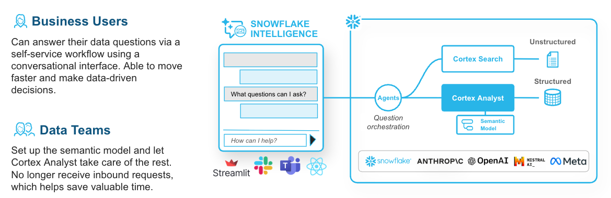
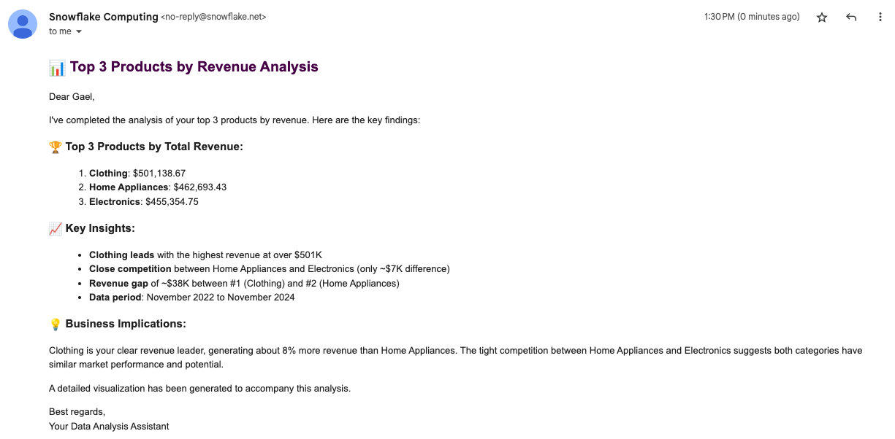

# Session 4: Snowflake Intelligence - Quick Reference



## Setup Snowflake Intelligence

```sql
USE ROLE ACCOUNTADMIN;
SET USERNAME = (SELECT CURRENT_USER());

-- Create database for Snowflake Intelligence
CREATE DATABASE IF NOT EXISTS snowflake_intelligence;
GRANT USAGE ON DATABASE snowflake_intelligence TO ROLE PUBLIC;

-- Create schema for agents
CREATE SCHEMA IF NOT EXISTS snowflake_intelligence.agents;
GRANT USAGE ON SCHEMA snowflake_intelligence.agents TO ROLE PUBLIC;

-- Grant agent creation privilege
GRANT CREATE AGENT ON SCHEMA snowflake_intelligence.agents TO ROLE ACCOUNTADMIN;

-- Set default role and warehouse (required)
ALTER USER identifier($USERNAME) SET DEFAULT_ROLE = ACCOUNTADMIN;
ALTER USER identifier($USERNAME) SET DEFAULT_WAREHOUSE = cortex_analyst_wh;

-- Enable cross-region inference (required)
ALTER ACCOUNT SET CORTEX_ENABLED_CROSS_REGION = 'ANY_REGION';
```

---

## Create Your First AI Agent

### Step 1: Create Agent

1. Navigate to **AI & ML** > **Agents** in Snowsight
2. Click **Create agent**
3. Configure:
   - **Agent object name**: `revenue_analyst_agent`
   - **Display name**: `Revenue Analyst Agent`
4. Click **Create agent**

---

### Step 2: Configure Agent

1. Click on the agent to open details
2. Click **Edit**
3. Configure:
   - **Description**: `AI agent for analyzing revenue data and answering business questions`
   - **Test Question**: `Sales revenue for product categories sold in Europe in 2024 & YoY % Growth`
4. Add test question

---

## Add Cortex Analyst Tool

1. Navigate to **Tools** tab
2. Click **+ Add**
3. Configure:
   - **Tool Type**: `Semantic view`
   - **Database**: `CORTEX_ANALYST_DEMO`
   - **Schema**: `REVENUE_TIMESERIES`
   - **Semantic view**: `REVENUE_TIMESERIES`
   - **Tool name**: `revenue_analyst_tool`
   - **Description**: `Query revenue, product, and regional data using natural language`
4. Click **Add**
5. Click **Save**

---

## Test Your Agent

1. Navigate to **AI & ML** > **Snowflake Intelligence**
2. Select **Revenue Analyst Agent**
3. Click on test question: "Sales revenue for product categories sold in Europe in 2024 & YoY % Growth"
4. Review results


---

## Example Questions

Try these questions:

1. What was the total revenue in 2024?
2. Compare revenue across all regions
3. Top 5 products by revenue
4. Monthly revenue trend for 2024
5. Monthly profit in Europe per category
6. List large orders from last month
7. YoY revenue growth by product line
8. Which region had the highest growth in 2024?

---

## Add Custom Email Tool (Optional)

### Step 1: Setup Email Integration

```sql
USE SCHEMA snowflake_intelligence.agents;

-- Create notification integration
CREATE OR REPLACE NOTIFICATION INTEGRATION snowflake_intelligence_email_integration
  TYPE=EMAIL
  ENABLED=TRUE
  DEFAULT_SUBJECT = 'Snowflake Cortex Demo';

-- Create email sending procedure
CREATE OR REPLACE PROCEDURE send_email(
    recipient_email VARCHAR,
    subject VARCHAR,
    body VARCHAR
)
RETURNS VARCHAR
LANGUAGE PYTHON
RUNTIME_VERSION = '3.12'
PACKAGES = ('snowflake-snowpark-python')
HANDLER = 'send_email'
AS
$$
def send_email(session, recipient_email, subject, body):
    try:
        escaped_body = body.replace("'", "''")
        session.sql(f"""
            CALL SYSTEM$SEND_EMAIL(
                'snowflake_intelligence_email_integration',
                '{recipient_email}',
                '{subject}',
                '{escaped_body}',
                'text/html'
            )
        """).collect()
        return "Email sent successfully"
    except Exception as e:
        return f"Error sending email: {str(e)}"
$$;
```

---

### Step 2: Add Email Tool to Agent

1. Navigate to **AI & ML** > **Agents**
2. Click on **Revenue Analyst Agent**
3. Click **Edit**
4. Navigate to **Tools** tab
5. Click **+ Add**
6. Configure:
   - **Resource type**: `procedure`
   - **Database & Schema**: `SNOWFLAKE_INTELLIGENCE.AGENTS`
   - **Custom tool identifier**: `SNOWFLAKE_INTELLIGENCE.AGENTS.SEND_EMAIL()`
   - **Tool name**: `send_email`
   - **Description**: `Send an email message. The email is well formatted, using HTML formatting. The email uses icons when applicable and various heading styles to add structure.`
7. Configure parameters:
   - **body**: `If body is not provided, summarize the last question and use that as content for the email.`
   - **recipient_email**: `If the email is not provided, send it to YOUR_EMAIL_ADDRESS_GOES_HERE.`
   - **subject**: `If subject is not provided, use "Snowflake Intelligence".`
8. Click **Add**
9. Click **Save**

---

### Step 3: Test Email Capabilities

1. Navigate to **AI & ML** > **Snowflake Intelligence**
2. Select **Revenue Analyst Agent**
3. Verify **send_email** tool is available
4. Ask: "Can you analyze the top 3 products by revenue and email me the results?"
5. Check your email inbox




---

**Previous**: [Session 2: Building with Cortex Analyst](SESSION_2_CORTEX_ANALYST_LIGHT.md) | [Session 3: Cortex Search Integration](SESSION_3_CORTEX_SEARCH_INTEGRATION_LIGHT.md)

